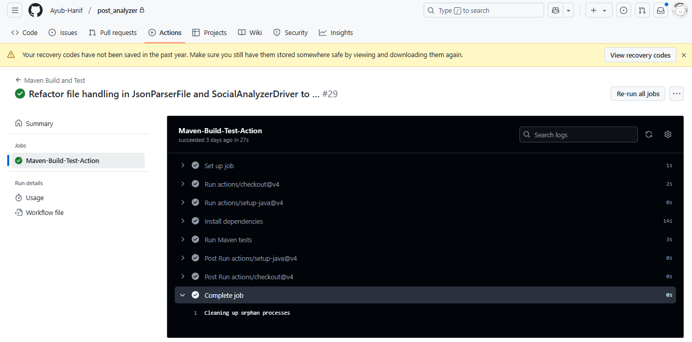
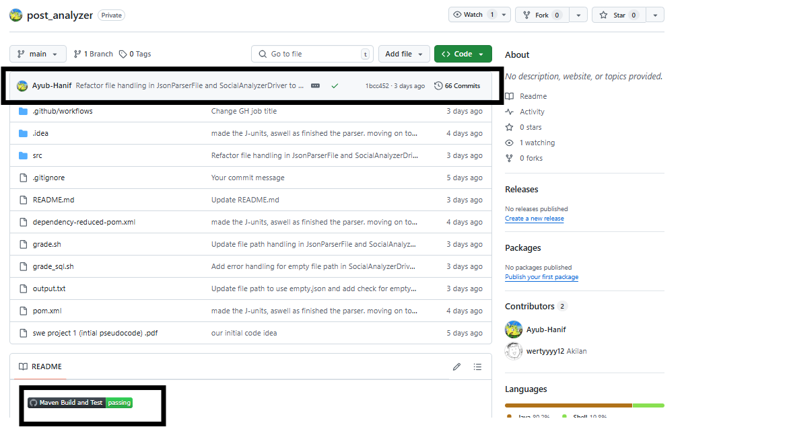

[](https://github.com/Ayub-Hanif/post_analyzer/actions/workflows/maven.yml)

This repository is located here: https://github.com/Ayub-Hanif/post_analyzer.

The creation of the `socialmedia_db` database is handled by our main function when constructing the `Database` object.

# ECS160 HW1: The Social Media Analysis

A Java application to store and analyze social media posts from Blue sky.
- Parses `input.json`
- Stores data in SQL
- We need to calculate statistics (total posts, avg replies, etc.)
- Supports weighted analysis (true/false)

# SQL Database Credentials
- sql_name = "socialmedia_db"
- User: postgres
- Password: 9981
- Connection URL: jdbc:postgresql://localhost:5432/socialmedia_db

## Getting Started
1. Clone this repo.
2. Run `mvn clean install` in IntelliJ or terminal.
3. Run the app with:
   ```bash
   java -jar target/HW1-solution-1.0-SNAPSHOT.jar

## GitHub Actions
Successful GitHub Action run:


GitHub Action badge:

